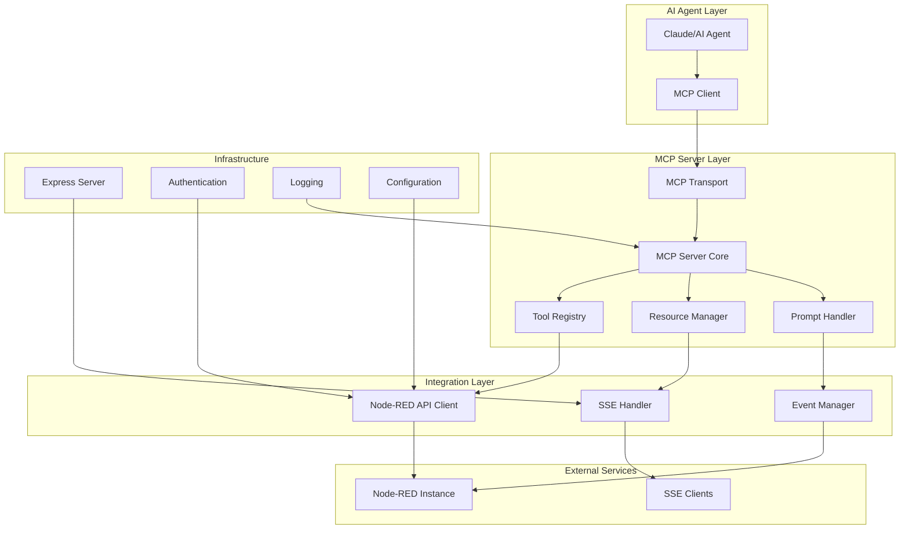

# System Patterns: MCP Node-RED SSE Integration Server

## Architecture Overview



## Core Design Patterns

### 1. Transport Abstraction Pattern
**Purpose**: Support multiple MCP transport modes (stdio, HTTP, combined)

```typescript
interface TransportConfig {
  mode: 'stdio' | 'http' | 'both';
  httpPort?: number;
  enableSSE?: boolean;
}

class TransportManager {
  async initializeTransports(config: TransportConfig): Promise<void>
  async startStdioTransport(): Promise<void>
  async startHttpTransport(): Promise<void>
}
```

**Benefits**:
- Flexible deployment options
- Easy testing with different transports
- Future-proof for new transport types

### 2. Service Layer Pattern
**Purpose**: Separate business logic from MCP protocol handling

```typescript
interface NodeRedService {
  flows: FlowService;
  nodes: NodeService;
  runtime: RuntimeService;
  events: EventService;
}

class FlowService {
  async listFlows(): Promise<Flow[]>
  async getFlow(id: string): Promise<Flow>
  async createFlow(flow: CreateFlowRequest): Promise<Flow>
  async updateFlow(id: string, flow: UpdateFlowRequest): Promise<Flow>
  async deleteFlow(id: string): Promise<void>
  async deployFlows(): Promise<void>
}
```

**Benefits**:
- Clear separation of concerns
- Testable business logic
- Reusable across different interfaces

### 3. Tool Registration Pattern
**Purpose**: Dynamic tool discovery and registration

```typescript
class ToolRegistry {
  private tools: Map<string, MCPTool> = new Map();
  
  registerTool(tool: MCPTool): void {
    this.tools.set(tool.name, tool);
  }
  
  async discoverTools(): Promise<void> {
    // Auto-register tools from service layers
    await this.registerFlowTools();
    await this.registerNodeTools();
    await this.registerRuntimeTools();
  }
}
```

**Benefits**:
- Automatic tool discovery
- Easy to add new capabilities
- Consistent tool interface

### 4. Event Streaming Pattern
**Purpose**: Real-time event delivery via Server-Sent Events

```typescript
class SSEManager {
  private connections: Map<string, SSEConnection> = new Map();
  
  addConnection(connectionId: string, response: Response): void
  removeConnection(connectionId: string): void
  broadcast(event: NodeRedEvent): void
  sendToConnection(connectionId: string, event: NodeRedEvent): void
}

interface NodeRedEvent {
  type: 'flow_status' | 'node_event' | 'error' | 'system';
  timestamp: number;
  data: any;
  flowId?: string;
  nodeId?: string;
}
```

**Benefits**:
- Real-time updates to AI agents
- Scalable connection management
- Flexible event filtering

### 5. Authentication Strategy Pattern
**Purpose**: Flexible authentication methods

```typescript
interface AuthStrategy {
  authenticate(request: Request): Promise<AuthResult>;
}

class JWTAuthStrategy implements AuthStrategy {
  async authenticate(request: Request): Promise<AuthResult>
}

class APIKeyAuthStrategy implements AuthStrategy {
  async authenticate(request: Request): Promise<AuthResult>
}

class AuthManager {
  private strategies: AuthStrategy[] = [];
  
  addStrategy(strategy: AuthStrategy): void
  async authenticate(request: Request): Promise<AuthResult>
}
```

**Benefits**:
- Multiple authentication methods
- Easy to add new auth types
- Consistent security interface

## Component Relationships

### 1. MCP Server Core
- **Responsibilities**: Protocol handling, request routing, response formatting
- **Dependencies**: Tool Registry, Resource Manager, Prompt Handler
- **Pattern**: Facade pattern for MCP protocol complexity

### 2. Node-RED API Client
- **Responsibilities**: HTTP communication with Node-RED Admin API
- **Dependencies**: Authentication, Configuration, Logging
- **Pattern**: Repository pattern for data access

### 3. SSE Handler
- **Responsibilities**: Real-time event streaming to clients
- **Dependencies**: Event Manager, Authentication
- **Pattern**: Observer pattern for event distribution

### 4. Express Application
- **Responsibilities**: HTTP server, middleware, routing
- **Dependencies**: SSE Handler, Authentication, CORS
- **Pattern**: Middleware chain pattern

## Key Technical Decisions

### 1. TypeScript Throughout
**Decision**: Use TypeScript for all code including configuration
**Rationale**: Type safety, better IDE support, runtime error prevention
**Trade-offs**: Slightly more complex build process, learning curve

### 2. Multiple Transport Support
**Decision**: Support both stdio and HTTP transports simultaneously
**Rationale**: Flexibility for different deployment scenarios
**Trade-offs**: Increased complexity, more configuration options

### 3. Service Layer Architecture
**Decision**: Separate business logic from protocol handling
**Rationale**: Testability, reusability, maintainability
**Trade-offs**: More abstraction layers, potential performance overhead

### 4. Event-Driven SSE
**Decision**: Use Server-Sent Events for real-time communication
**Rationale**: Simple implementation, broad browser support, natural fit for monitoring
**Trade-offs**: One-way communication only, potential connection limits

### 5. Zod for Validation
**Decision**: Use Zod for runtime type validation
**Rationale**: TypeScript integration, comprehensive validation, good error messages
**Trade-offs**: Additional dependency, learning curve

## Error Handling Patterns

### 1. Layered Error Handling
```typescript
// Service layer: Business logic errors
class FlowNotFoundError extends Error {
  constructor(flowId: string) {
    super(`Flow not found: ${flowId}`);
    this.name = 'FlowNotFoundError';
  }
}

// API layer: HTTP errors
class NodeRedAPIError extends Error {
  constructor(status: number, message: string) {
    super(`Node-RED API error (${status}): ${message}`);
    this.name = 'NodeRedAPIError';
  }
}

// MCP layer: Protocol errors
class MCPToolError extends Error {
  constructor(toolName: string, message: string) {
    super(`MCP tool '${toolName}' failed: ${message}`);
    this.name = 'MCPToolError';
  }
}
```

### 2. Graceful Degradation
- SSE connections handle temporary disconnections
- MCP tools provide partial results when possible
- Node-RED API calls include retry logic with exponential backoff

### 3. Comprehensive Logging
- Structured logging with Winston
- Request/response tracking
- Error context preservation
- Performance metrics collection

This architecture ensures scalability, maintainability, and robust error handling while providing the flexibility needed for various deployment scenarios.
